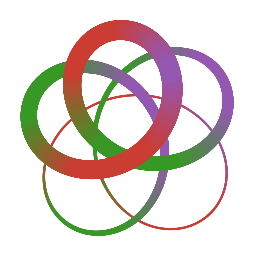

# Strs

[![][gitter-img]][gitter-url]
[![contributions welcome][contrib]](https://github.com/JuliaString/Strs.jl/issues)
[![][release]][strs-url]
[![][release-date]][strs-url]
[![][license-img]][license-url]

[contrib]:    https://img.shields.io/badge/contributions-welcome-brightgreen.svg?style=flat

| **Julia** | **Windows** | **Linux & MacOS** | **Package Evaluator** | **CodeCov** | **Coveralls** |
|:------------------:|:------------------:|:------------------:|:---------------------:|:-----------------:|:---------------------:|
| [![][julia-release]][julia-url] | [![][app-s-img]][app-s-url] | [![][travis-s-img]][travis-url] | [![][pkg-s-img]][pkg-s-url] | [![][codecov-img]][codecov-url] | [![][coverall-s-img]][coverall-s-url]
| [Latest][julia-url] | [![][app-m-img]][app-m-url] | [![][travis-m-img]][travis-url] | [![][pkg-m-img]][pkg-m-url] | [![][codecov-img]][codecov-url] | [![][coverall-m-img]][coverall-m-url]

[license-img]:  http://img.shields.io/badge/license-MIT-brightgreen.svg?style=flat
[license-url]:  LICENSE.md

[gitter-img]:   https://badges.gitter.im/Join%20Chat.svg
[gitter-url]:   https://gitter.im/JuliaString/Lobby?utm_source=badge&utm_medium=badge&utm_campaign=pr-badge

[strs-url]:     https://github.com/JuliaString/Strs.jl
[release]:      https://img.shields.io/github/release/JuliaString/Strs.jl.svg
[release-date]: https://img.shields.io/github/release-date/JuliaString/Strs.jl.svg

[julia-url]:          https://github.com/JuliaLang/julia
[julia-release]:      https://img.shields.io/github/release/JuliaLang/julia.svg

[travis-url]:   https://travis-ci.org/JuliaString/Strs.jl
[travis-s-img]: https://travis-ci.org/JuliaString/Strs.jl.svg
[travis-m-img]: https://travis-ci.org/JuliaString/Strs.jl.svg?branch=master

[app-s-url]:    https://ci.appveyor.com/project/ScottPJones/strs-jl
[app-m-url]:    https://ci.appveyor.com/project/ScottPJones/strs-jl/branch/master
[app-s-img]:    https://ci.appveyor.com/api/projects/status/evgf40ra7bcpm6i2?svg=true
[app-m-img]:    https://ci.appveyor.com/api/projects/status/evgf40ra7bcpm6i2/branch/master?svg=true

[pkg-s-url]:    http://pkg.julialang.org/detail/Strs
[pkg-m-url]:    http://pkg.julialang.org/detail/Strs
[pkg-s-img]:    http://pkg.julialang.org/badges/Strs_0.6.svg
[pkg-m-img]:    http://pkg.julialang.org/badges/Strs_0.7.svg
[pkg-r-img]:    http://pkg.julialang.org/badges/Strs_1.0.svg

[codecov-url]:  https://codecov.io/gh/JuliaString/Strs.jl
[codecov-img]:  https://codecov.io/gh/JuliaString/Strs.jl/branch/master/graph/badge.svg

[coverall-s-url]: https://coveralls.io/github/JuliaString/Strs.jl
[coverall-m-url]: https://coveralls.io/github/JuliaString/Strs.jl?branch=master
[coverall-s-img]: https://coveralls.io/repos/github/JuliaString/Strs.jl/badge.svg
[coverall-m-img]: https://coveralls.io/repos/github/JuliaString/Strs.jl/badge.svg?branch=master

It represents an attempt to give Julia better string handling than possible with Base `String` and `Char`.

I am now trying to make sure that all of the functionality in String and Char is implemented for
Str and Chr, and to start optimizing the functions (although they are already substantially faster)

Strs.jl is now a container for a number of different packages from [JuliaString.org](http://juliastring.org)

| **Package** | **Release** | **Release Date** | **Linux & MacOS** | **Windows** | **Description** |
|:-------------:|:-------------:|:-------------:|:-----------:|:-----------:|:-------------------|
| [ModuleInterfaceTools][mit-loc] | [![][mit-rel]][mit-loc] | [![][mit-dat]][mit-loc] | [![][mit-tvs-img]][mit-tvs-url] | [![][mit-app-img]][mit-app-url] | Tools to create a common API for all of these packages
| [StrAPI][strapi-loc] | [![][strapi-rel]][strapi-loc] | [![][strapi-dat]][strapi-loc]  | [![][strapi-tvs-img]][strapi-tvs-url] | [![][strapi-app-img]][strapi-app-url] | Common API for string/character functionality
| [CharSetEncodings][cse-loc] | [![][cse-rel]][cse-loc] | [![][cse-dat]][cse-loc]  | [![][cse-tvs-img]][cse-tvs-url] | [![][cse-app-img]][cse-app-url] | Basic types/support for Character Sets, Encodings, and Character Set Encodings
| [ChrBase][chrbase-loc] | [![][chrbase-rel]][chrbase-loc] | [![][chrbase-dat]][chrbase-loc]  | [![][chrbase-tvs-img]][chrbase-tvs-url] | [![][chrbase-app-img]][chrbase-app-url] | `Chr{CharSet,CodeUnitType}` type and support
| [MurmurHash3][mh3-loc] | [![][mh3-rel]][mh3-loc] | [![][mh3-dat]][mh3-loc]  | [![][mh3-tvs-img]][mh3-tvs-url] | [![][mh3-app-img]][mh3-app-url] | Pure Julia implementation of MurmurHash3
| [PCRE2][pcre2-loc] | [![][pcre2-rel]][pcre2-loc] | [![][pcre2-dat]][pcre2-loc]  | [![][pcre2-tvs-img]][pcre2-tvs-url] | [![][pcre2-app-img]][pcre2-app-url] | `PCRE2` library support
| [Format][format-loc] | [![][format-rel]][format-loc] | [![][format-dat]][format-loc]  | [![][format-tvs-img]][format-tvs-url] | [![][format-app-img]][format-app-url] | Python/C style formatting (based on [Formatting](https://github.com/JuliaIO/Formatting.jl))
| [StrBase][strbase-loc] | [![][strbase-rel]][strbase-loc] | [![][strbase-dat]][strbase-loc]  | [![][strbase-tvs-img]][strbase-tvs-url] | [![][strbase-app-img]][strbase-app-url] | `Str{CSE, Hash, SubSet, Cache}` type
| [StrRegex][strregex-loc] | [![][strregex-rel]][strregex-loc] | [![][strregex-dat]][strregex-loc]  | [![][strregex-tvs-img]][strregex-tvs-url] | [![][strregex-app-img]][strregex-app-url] | `Regex` support for all string types
| [StrLiterals][strliterals-loc] | [![][strliterals-rel]][strliterals-loc] | [![][strliterals-dat]][strliterals-loc]  | [![][strliterals-tvs-img]][strliterals-tvs-url] | [![][strliterals-app-img]][strliterals-app-url] | Extensible string literal support
| [StrFormat][strformat-loc] | [![][strformat-rel]][strformat-loc] | [![][strformat-dat]][strformat-loc]  | [![][strformat-tvs-img]][strformat-tvs-url] | [![][strformat-app-img]][strformat-app-url] | Formatting extensions for literals
| [StrTables][strtables-loc] | [![][strtables-rel]][strtables-loc] | [![][strtables-dat]][strtables-loc]  | [![][strtables-tvs-img]][strtables-tvs-url] | [![][strtables-app-img]][strtables-app-url] | Low-level support for entity tables
| [HTML_Entities][html-loc] | [![][html-rel]][html-loc] | [![][html-dat]][html-loc]  | [![][html-tvs-img]][html-tvs-url] | [![][html-app-img]][html-app-url] | HTML character sequences
| [Emoji_Entities][emoji-loc] | [![][emoji-rel]][emoji-loc] | [![][emoji-dat]][emoji-loc]  | [![][emoji-tvs-img]][emoji-tvs-url] | [![][emoji-app-img]][emoji-app-url] | Emoji names (including composite ones)
| [LaTeX_Entities][latex-loc] | [![][latex-rel]][latex-loc] | [![][latex-dat]][latex-loc]  | [![][latex-tvs-img]][latex-tvs-url] | [![][latex-app-img]][latex-app-url] | Julia LaTeX character names
| [Unicode_Entities][unicode-loc] | [![][unicode-rel]][unicode-loc] | [![][unicode-dat]][unicode-loc]  | [![][unicode-tvs-img]][unicode-tvs-url] | [![][unicode-app-img]][unicode-app-url] | Unicode standard character names
| [StrEntities][strentities-loc] | [![][strentities-rel]][strentities-loc] | [![][strentities-dat]][strentities-loc]  | [![][strentities-tvs-img]][strentities-tvs-url] | [![][strentities-app-img]][strentities-app-url] | Entity extensions for literals
| [InternedStrings][int-loc] | [![][int-rel]][int-loc] | [![][int-dat]][int-loc]  | [![][int-tvs-img]][int-tvs-url] | [![][int-app-img]][int-app-url] | Save space by interning strings (by @oxinabox!)

[mit-loc]:     https://github.com/JuliaString/ModuleInterfaceTools.jl
[mit-tvs-img]: https://travis-ci.org/JuliaString/ModuleInterfaceTools.jl.svg?branch=master
[mit-tvs-url]: https://travis-ci.org/JuliaString/ModuleInterfaceTools.jl
[mit-app-img]: https://ci.appveyor.com/api/projects/status/x13gh7y6id3fbmke/branch/master?svg=true
[mit-app-url]: https://ci.appveyor.com/project/ScottPJones/moduleinterfacetools-jl/branch/master
[mit-rel]:     https://img.shields.io/github/release/JuliaString/ModuleInterfaceTools.jl.svg?label="."
[mit-dat]:     https://img.shields.io/github/release-date/JuliaString/ModuleInterfaceTools.jl.svg?label="."

[mh3-loc]:     https://github.com/JuliaString/MurmurHash3.jl
[mh3-tvs-img]: https://travis-ci.org/JuliaString/MurmurHash3.jl.svg?branch=master
[mh3-tvs-url]: https://travis-ci.org/JuliaString/MurmurHash3.jl
[mh3-app-img]: https://ci.appveyor.com/api/projects/status/q55ln7mp20ph5cko/branch/master?svg=true
[mh3-app-url]: https://ci.appveyor.com/project/ScottPJones/MurmurHash3-jl/branch/master
[mh3-rel]:     https://img.shields.io/github/release/JuliaString/MurmurHash3.jl.svg?label="."
[mh3-dat]:     https://img.shields.io/github/release-date/JuliaString/MurmurHash3.jl.svg?label="."

[pcre2-loc]:     https://github.com/JuliaString/PCRE2.jl
[pcre2-tvs-img]: https://travis-ci.org/JuliaString/PCRE2.jl.svg?branch=master
[pcre2-tvs-url]: https://travis-ci.org/JuliaString/PCRE2.jl
[pcre2-app-img]: https://ci.appveyor.com/api/projects/status/d62uhoik906m7n8r/branch/master?svg=true
[pcre2-app-url]: https://ci.appveyor.com/project/ScottPJones/pcre2-jl/branch/master
[pcre2-rel]:     https://img.shields.io/github/release/JuliaString/PCRE2.jl.svg?label="."
[pcre2-dat]:     https://img.shields.io/github/release-date/JuliaString/PCRE2.jl.svg?label="."

[format-loc]:     https://github.com/JuliaString/Format.jl
[format-tvs-img]: https://travis-ci.org/JuliaString/Format.jl.svg?branch=master
[format-tvs-url]: https://travis-ci.org/JuliaString/Format.jl
[format-app-img]: https://ci.appveyor.com/api/projects/status/9wb580eyjv4k3iej/branch/master?svg=true
[format-app-url]: https://ci.appveyor.com/project/ScottPJones/format-jl/branch/master
[format-rel]:     https://img.shields.io/github/release/JuliaString/Format.jl.svg?label="."
[format-dat]:     https://img.shields.io/github/release-date/JuliaString/Format.jl.svg?label="."

[strapi-loc]:     https://github.com/JuliaString/StrAPI.jl
[strapi-tvs-img]: https://travis-ci.org/JuliaString/StrAPI.jl.svg?branch=master
[strapi-tvs-url]: https://travis-ci.org/JuliaString/StrAPI.jl
[strapi-app-img]: https://ci.appveyor.com/api/projects/status/pyw9o1y3wywo95tt/branch/master?svg=true
[strapi-app-url]: https://ci.appveyor.com/project/ScottPJones/strapi-jl/branch/master
[strapi-rel]:     https://img.shields.io/github/release/JuliaString/StrAPI.jl.svg?label="."
[strapi-dat]:     https://img.shields.io/github/release-date/JuliaString/StrAPI.jl.svg?label="."

[cse-loc]:     https://github.com/JuliaString/CharSetEncodings.jl
[cse-tvs-img]: https://travis-ci.org/JuliaString/CharSetEncodings.jl.svg?branch=master
[cse-tvs-url]: https://travis-ci.org/JuliaString/CharSetEncodings.jl
[cse-app-img]: https://ci.appveyor.com/api/projects/status/08ylxl46exltiemd/branch/master?svg=true
[cse-app-url]: https://ci.appveyor.com/project/ScottPJones/charsetencodings-jl/branch/master
[cse-rel]:     https://img.shields.io/github/release/JuliaString/CharSetEncodings.jl.svg?label="."
[cse-dat]:     https://img.shields.io/github/release-date/JuliaString/CharSetEncodings.jl.svg?label="."

[chrbase-loc]:     https://github.com/JuliaString/ChrBase.jl
[chrbase-tvs-img]: https://travis-ci.org/JuliaString/ChrBase.jl.svg?branch=master
[chrbase-tvs-url]: https://travis-ci.org/JuliaString/ChrBase.jl
[chrbase-app-img]: https://ci.appveyor.com/api/projects/status/lrdfni7si4o797fr/branch/master?svg=true
[chrbase-app-url]: https://ci.appveyor.com/project/ScottPJones/chrbase-jl/branch/master
[chrbase-rel]:     https://img.shields.io/github/release/JuliaString/ChrBase.jl.svg?label="."
[chrbase-dat]:     https://img.shields.io/github/release-date/JuliaString/ChrBase.jl.svg?label="."

[strbase-loc]:     https://github.com/JuliaString/StrBase.jl
[strbase-tvs-img]: https://travis-ci.org/JuliaString/StrBase.jl.svg?branch=master
[strbase-tvs-url]: https://travis-ci.org/JuliaString/StrBase.jl
[strbase-app-img]: https://ci.appveyor.com/api/projects/status/2v12uwlr0ueale6n/branch/master?svg=true
[strbase-app-url]: https://ci.appveyor.com/project/ScottPJones/strbase-jl/branch/master
[strbase-rel]:     https://img.shields.io/github/release/JuliaString/StrBase.jl.svg?label="."
[strbase-dat]:     https://img.shields.io/github/release-date/JuliaString/StrBase.jl.svg?label="."

[strregex-loc]:     https://github.com/JuliaString/StrRegex.jl
[strregex-tvs-img]: https://travis-ci.org/JuliaString/StrRegex.jl.svg?branch=master
[strregex-tvs-url]: https://travis-ci.org/JuliaString/StrRegex.jl
[strregex-app-img]: https://ci.appveyor.com/api/projects/status/iyhlb4unq5ml4g0w/branch/master?svg=true
[strregex-app-url]: https://ci.appveyor.com/project/ScottPJones/strregex-jl/branch/master
[strregex-rel]:     https://img.shields.io/github/release/JuliaString/StrRegex.jl.svg?label="."
[strregex-dat]:     https://img.shields.io/github/release-date/JuliaString/StrRegex.jl.svg?label="."

[strliterals-loc]:     https://github.com/JuliaString/StrLiterals.jl
[strliterals-tvs-img]: https://travis-ci.org/JuliaString/StrLiterals.jl.svg?branch=master
[strliterals-tvs-url]: https://travis-ci.org/JuliaString/StrLiterals.jl
[strliterals-app-img]: https://ci.appveyor.com/api/projects/status/8462oq09ek07knos/branch/master?svg=true
[strliterals-app-url]: https://ci.appveyor.com/project/ScottPJones/strliterals-jl/branch/master
[strliterals-rel]:     https://img.shields.io/github/release/JuliaString/StrLiterals.jl.svg?label="."
[strliterals-dat]:     https://img.shields.io/github/release-date/JuliaString/StrLiterals.jl.svg?label="."

[strformat-loc]:     https://github.com/JuliaString/StrFormat.jl
[strformat-tvs-img]: https://travis-ci.org/JuliaString/StrFormat.jl.svg?branch=master
[strformat-tvs-url]: https://travis-ci.org/JuliaString/StrFormat.jl
[strformat-app-img]: https://ci.appveyor.com/api/projects/status/r3c2alh3jfcmu2gc/branch/master?svg=true
[strformat-app-url]: https://ci.appveyor.com/project/ScottPJones/strformat-jl/branch/master
[strformat-rel]:     https://img.shields.io/github/release/JuliaString/StrFormat.jl.svg?label="."
[strformat-dat]:     https://img.shields.io/github/release-date/JuliaString/StrFormat.jl.svg?label="."

[strtables-loc]:     https://github.com/JuliaString/StrTables.jl
[strtables-tvs-img]: https://travis-ci.org/JuliaString/StrTables.jl.svg?branch=master
[strtables-tvs-url]: https://travis-ci.org/JuliaString/StrTables.jl
[strtables-app-img]: https://ci.appveyor.com/api/projects/status/ekt5t6nt8g0cqhjb/branch/master?svg=true
[strtables-app-url]: https://ci.appveyor.com/project/ScottPJones/strtables-jl/branch/master
[strtables-rel]:     https://img.shields.io/github/release/JuliaString/StrTables.jl.svg?label="."
[strtables-dat]:     https://img.shields.io/github/release-date/JuliaString/StrTables.jl.svg?label="."

[html-loc]:     https://github.com/JuliaString/HTML_Entities.jl
[html-tvs-img]: https://travis-ci.org/JuliaString/HTML_Entities.jl.svg?branch=master
[html-tvs-url]: https://travis-ci.org/JuliaString/HTML_Entities.jl
[html-app-img]: https://ci.appveyor.com/api/projects/status/xp05kd5mamt92yhj/branch/master?svg=true
[html-app-url]: https://ci.appveyor.com/project/ScottPJones/html-entities-jl/branch/master
[html-rel]:     https://img.shields.io/github/release/JuliaString/HTML_Entities.jl.svg?label="."
[html-dat]:     https://img.shields.io/github/release-date/JuliaString/HTML_Entities.jl.svg?label="."

[emoji-loc]:     https://github.com/JuliaString/Emoji_Entities.jl
[emoji-tvs-img]: https://travis-ci.org/JuliaString/Emoji_Entities.jl.svg?branch=master
[emoji-tvs-url]: https://travis-ci.org/JuliaString/Emoji_Entities.jl
[emoji-app-img]: https://ci.appveyor.com/api/projects/status/4p6o3reehca95put/branch/master?svg=true

[emoji-app-url]: https://ci.appveyor.com/project/ScottPJones/emoji-entities-jl/branch/master
[emoji-rel]:     https://img.shields.io/github/release/JuliaString/Emoji_Entities.jl.svg?label="."
[emoji-dat]:     https://img.shields.io/github/release-date/JuliaString/Emoji_Entities.jl.svg?label="."

[latex-loc]:     https://github.com/JuliaString/LaTeX_Entities.jl
[latex-tvs-img]: https://travis-ci.org/JuliaString/LaTeX_Entities.jl.svg?branch=master
[latex-tvs-url]: https://travis-ci.org/JuliaString/LaTeX_Entities.jl
[latex-app-img]: https://ci.appveyor.com/api/projects/status/ok2sdq4u5xwlc6b0/branch/master?svg=true
[latex-app-url]: https://ci.appveyor.com/project/ScottPJones/latex-entities-jl/branch/master
[latex-rel]:     https://img.shields.io/github/release/JuliaString/LaTeX_Entities.jl.svg?label="."
[latex-dat]:     https://img.shields.io/github/release-date/JuliaString/LaTeX_Entities.jl.svg?label="."

[unicode-loc]:     https://github.com/JuliaString/Unicode_Entities.jl
[unicode-tvs-img]: https://travis-ci.org/JuliaString/Unicode_Entities.jl.svg?branch=master
[unicode-tvs-url]: https://travis-ci.org/JuliaString/Unicode_Entities.jl
[unicode-app-img]: https://ci.appveyor.com/api/projects/status/c1luci97ry8fxdt7/branch/master?svg=true
[unicode-app-url]: https://ci.appveyor.com/project/ScottPJones/unicode-entities-jl/branch/master
[unicode-rel]:     https://img.shields.io/github/release/JuliaString/Unicode_Entities.jl.svg?label="."
[unicode-dat]:     https://img.shields.io/github/release-date/JuliaString/Unicode_Entities.jl.svg?label="."

[strentities-loc]:     https://github.com/JuliaString/StrEntities.jl
[strentities-tvs-img]: https://travis-ci.org/JuliaString/StrEntities.jl.svg?branch=master
[strentities-tvs-url]: https://travis-ci.org/JuliaString/StrEntities.jl
[strentities-app-img]: https://ci.appveyor.com/api/projects/status/5pj0ubfrai4dsp0r/branch/master?svg=true
[strentities-app-url]: https://ci.appveyor.com/project/ScottPJones/strentities-jl/branch/master
[strentities-rel]:     https://img.shields.io/github/release/JuliaString/StrEntities.jl.svg?label="."
[strentities-dat]:     https://img.shields.io/github/release-date/JuliaString/StrEntities.jl.svg?label="."

[int-loc]:     https://github.com/JuliaString/InternedStrings.jl
[int-tvs-img]: https://travis-ci.org/JuliaString/InternedStrings.jl.svg?branch=master
[int-tvs-url]: https://travis-ci.org/JuliaString/InternedStrings.jl
[int-app-img]: https://ci.appveyor.com/api/projects/status/8dlhr5sprhokwyqb/branch/master?svg=true

[int-app-url]: https://ci.appveyor.com/project/ScottPJones/internedstrings-jl/branch/master
[int-rel]:     https://img.shields.io/github/release/JuliaString/InternedStrings.jl.svg?label="."
[int-dat]:     https://img.shields.io/github/release-date/JuliaString/InternedStrings.jl.svg?label="."

The new package [ModuleInterfaceTools](https://github.com/JuliaString/ModuleInterfaceTools.jl) is used to set up a consistent and easy to use API for most of the cooperating packages, without having to worry too much about imports, exports, using, and what functions are part of a public API, and which ones are part of the internal development API for other packages to extend.

I would very much appreciate any constructive criticism, help implementing some of the ideas, ideas on how to make it perform better, bikeshedding on names and API, etc.
Also, I'd love contributions of benchmark code and/or samples for different use cases of strings,
or pointers to such (such as a way to get lots of tweets, to test mixed text and emojis, for example).

## Architecture and Operations

The general philosophy of the architecture is as follows: have a single easy to use type that can replace `String` that conforms to the recommendations of the Unicode Organization (which internally uses 4 types and is implemented currently as a Julia Union, and has O(1) indexing to characters, not just code units), as well as types to represent binary strings, raw unvalidated strings (made up of 1, 2, or 4 byte codepoints), as well as types for validated ASCII, Latin1, UCS2 (16-bit, BMP [Basic Multilingual Plane]), UTF-8, UTF-16, and UTF-32 encoded strings.

Optimizations for multi code unit encodings such as UTF-8 & UTF-16 will be moved to `StrUTF8` and `StrUTF16` packages (before splitting them out, I'll make sure that the functionality still works, only with slower generic methods, so that you only take up the extra space if you need the faster speed).
Extensions such as converting to and from non-Unicode encodings, such as Windows CP-1252 or China's official character set, GB18030,  will be done in another package, `StrEncodings`.

Subtypes that directly support things like substrings, caching hash values, and caching one or more versions of the string (such as the originally unmodified byte, 16-bit or 32-bit word stream, in the case where the input was not valid, or a valid UTF-8 (similar to the way Python can cache a UTF-8 version of a string) and/or UTF-16 encoded version, for better performance when interoperating with other languages such as JavaScript, Swift, Java, or OS APIs like Windows that expect UTF-16).

Since things like `AbstractChar` and `CodeUnits` which I originally implemented for this package have now been added to `Base` (in master), I have moved support for those to a file to provide them for v0.6.2.
There is a `codepoints` iterator, which iterates over the unsigned integer codepoints in a string
(for strings with the `CodeUnitSingle` trait, it is basically the same as the `codeunits`
iterator).

Also in the works is using the new ability to add properties, in order to allow for different "views" of a string, no matter how it is stored internally, for example a `mystring.utf8` view, or a `mystring.utf16` view (that can use the internal cached copy if available, as an optimization).

## Types
Currently, there are the following types:

* `Str`, which is the general, parameterized string type, and
* `Chr`, the general, parameterized character type.

* `BinaryStr` for storing non-textual data as a sequence of bytes.

* `ASCIIStr`   an ASCII string, composed of `ASCIIChr` 1-byte codepoints
* `LatinStr`   a string using the Latin1 subset of Unicode, composed of `LatinChr` 1-byte codepoints.
* `UCS2Str`    a string composed of characters (`UCS2Chr`s) only in the Unicode BMP, stored as 2 byte code units (that each store a single codepoint)
* `UTF32Str`   a string with only valid Unicode characters, 0-0xd7ff, 0xe000-0x10ffff, stored as 4 byte code units.

* `UTF8Str`    a string with only valid Unicode characters, the same as `UTF32Str`, however encoded using UTF-8, conforming to the Unicode Organization's standard, i.e. no long encodings, surrogates, or invalid bytes.
* `UTF16Str`   a string similar to `UTF8Str, encoded via UTF-16, also conforming to the Unicode standard, i.e. no out of order or isolated surrogates.

* `Text1Str`   a text string that may contain any sequence of bytes
* `Text2Str`   a text string that may contain any sequence of 16-bit words
* `Text4Str`   a text string that may contain any sequence of 32-bit words

* `UniStr`     a Union type, that can be one of the following 4 types, `ASCIIStr`, and 3 internal types:
* `_LatinStr`  a byte string that must contain at least one character > 0x7f
* `_UCS2Str`   a word string that must contain at least one character > 0xff
* `_UTF32Str`  a 32-bit word string that must contain at least one character > 0xffff

The only real difference in handling `LatinStr` and `_LatinStr`, is that uppercasing the characters `'µ': (Unicode U+00b5 (category Ll: Letter, lowercase)` and `'ÿ': Unicode U+00ff (category Ll: Letter, lowercase)` produces the BMP characters `'Μ': Unicode U+039c (category Lu: Letter, uppercase)` and `'Ÿ': Unicode U+0178 (category Lu: Letter, uppercase)` respectively in `_LatinStr`, because it is just an optimization for storing the full Unicode character set, not the ANSI/ISO 8859-1 character set that ise used for the first 256 code points of Unicode.
Those three internal types should never be used directly, as indicated by the leading `_` in the name.

For all of the built-in `Str` types, there is a corresponding built-in character set encoding, i.e. `BinaryCSE`, `LatinCSE`, `UTF8CSE`, etc.
There are also a number of similar built-in character sets defined (`*CharSet`), and character types (`*Chr`).
The `cse` function returns the character set encoding for a string type or a string.
`charset` returns the character set, and `encoding` returns the encoding.
For example, `cse(UTF8Str)` returns `UTF8CSE`, `charset(UTF8Str)` returns `CharSet{UTF32}`,
`encoding(UTF8Str)` return `Encoding{UTF8}()`

## Functions

There is a new API that I am working on for indexing and searching, (however there is a problem on v0.7 due to the deprecation for `find` being overbroad, and causing a type of type piracy, deprecating methods of types not in Base):

* `find(First, ...)` replaces `findfirst`
* `find(Last, ...)`  replaces `findlast`
* `find(Next, ...)`  replaces `findnext`
* `find(Prev, ...)`  replaces `findprev`

* `index(str, pos)`  replaces `thisind(str, pos)`
* `index(Next, ...`  replaces `nextind(...)`
* `index(Prev, ...`  replaces `prevind(...)`

Also there are more readable function names that always separate words with `_`, and avoid hard to understand abbreviations:

* `is*`              -> `is_*` (for `ascii`, `digit`, `space`, `numeric`, `valid`,
		                  `defined`, `empty`, `assigned`)
* `iscntrl`          -> `is_control`
* `isgraph`          -> `is_graphic`
* `isprint`          -> `is_printable`
* `ispunct`          -> `is_punctuation`
* `isalpha`          -> `is_letter`
* `isalnum`          -> `is_alphanumeric`
* `isgraphemebreak`  -> `is_grapheme_break`
* `isgraphemebreak!` -> `is_grapheme_break!`
* `occursin`         -> `occurs_in`
* `textwidth`        -> `text_width`
* `lowercasefirst`   -> `lowercase_first`
* `uppercasefirst`   -> `uppercase_first`
* `startswith`       -> `starts_with`
* `endswith`         -> `ends_with`

* In addition, I've added `is_alphabetic`

## Kudos

Nobody is an island, and to achieve great things, one must stand on the shoulders of giants.

I would like to thank some of those giants in particular:

* The four co-creators of Julia: [Jeff Bezanson](https://github.com/JeffBezanson),[Viral B. Shah](https://github.com/ViralBShah), [Alan Edelman](https://github.com/alanedelman), and [Stefan Karpinski](https://github.com/StefanKarpinski), without their uncompromising greediness, none of this would be possible.

* [Tom Breloff](https://github.com/tbreloff), for showing how an ecosystem could be created in Julia, i.e. "Build it, and they will come", for providing some nice code in this [PR](https://github.com/JuliaIO/Formatting.jl/pull/10) (which I shamelessly pirated in order to create [Format](https://github.com/JuliaString/Format.jl), and for good advice at JuliaCon.
* [Ismael Venegas Castelló](https://twitter.com/SalchiPapa1337) for encouraging me to [tweet](https://twitter.com/GandalfSoftware) about Julia starting at the 2015 JuliaCon, for good advice, and being a great guy in general.
* [Chris Rackaukas](https://github.com/ChrisRackauckas) simply a star in Julia now, great guy, great advice, and great blogs about stuff that's usually way over my head. Julia is incredibly lucky to have him.
* [Jacob Quinn](https://github.com/quinnj), for collaborating & discussions early on in [Strings](https://github.com/quinnj/Strings.jl) on ideas for better string support in Julia, as well as a lot of hard work on things dear to me, such as databases and importing/exporting data [SQLite](https://github.com/JuliaDatabases/SQLite.jl), [ODBC](https://github.com/JuliaDatabases/ODBC.jl), [CSV](https://github.com/JuliaData/CSV.jl), [WeakRefStrings](https://github.com/JuliaData/WeakRefStrings.jl), [DataStreams](https://github.com/JuliaData/DataStreams.jl), [Feather](https://github.com/JuliaData/Feather.jl), [JSON2](https://github.com/quinnj/JSON2.jl)
* [Milan Bouchet-Valat](https://github.com/nalimilan), for discussions on string handling and encoding in [StringEncodings](https://github.com/nalimilan/StringEncodings.jl)
* [Tim Holy](https://github.com/timholy) for the famous "Holy" Trait Trick, which I use extensively in the Str* packages, for the work along with [Matt Bauman](https://github.com/mbauman) on making Julia arrays general, extensible while still performing well, and hence very useful in my work.
* [Steven G. Johnson]() for illuminating me on how one could create a whole package in very few lines of code when I first started learning Julia, see [DecFP](https://github.com/stevengj/DecFP.jl)
* [Tony Kelman](https://github.com/tkelman), for very thorough reviews of my PRs, I learned a great deal from his (and other Julians') comments), including that I didn't have to code in C anymore to get the performance I desired.

* [Lyndon White](https://github.com/oxinabox), I've already "appropriated" :grinning: his very nice [InternedStrings](https://github.com/JuliaString/InternedStrings.jl) into this package, I'm really lucky to have gotten him to join the organization!
* [Bogumił Kamiński](https://github.com/bkamins) who has been doing a great job testing and reviewing `Strs` (as well as doing the same for the string/character support in Julia Base), as well as input into the design. (Also very glad to have co-opted him to become a member of the org)
* Last but not least, Julia mathematical artist (and blogger!) extraordinaire, [Cormullion](https://github.com/cormullion), creator of our wonderful logo!

Also thanks to anybody who's answered my (sometimes stupid :grinning:) questions on [Gitter](https://gitter.im/JuliaLang/julia) and [Discourse](https://discourse.julialang.org/)

Kudos to all of the other contributors to Julia and the ever expanding Julia ecosystem!
